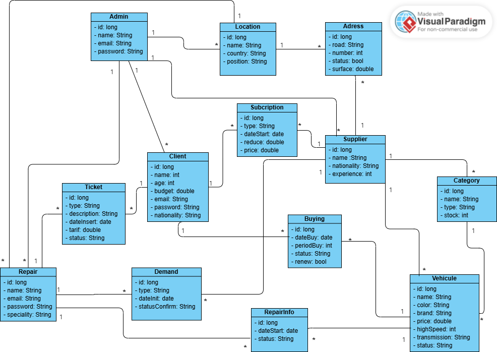

# Vehicule Rent Backend 

## Introduction
Welcome to the Vehicule Rent Backend! This project is designed to manage vehicules renting system. Built using **Spring Boot**, it provides an easy-to-use functionalities for administrators, suppliers, repairers and clients.

## Actors
This application supports the following user roles:
- **Admin**: Manages the system, including user accounts and existed locations.
- **Repairer**: Handles vehicle maintenance and repairs. In fact, he can use tickets and send demands to the supplier to approve the reparation of the car for which has the full repairInfos.
- **Supplier**: Provides vehicle inventory and details. In addition, he has what we call categories for his vehicules.
- **Client**: Books and manages car rentals.

## File Descriptions

### Backend (Spring Boot)
- `src/main/java/com/project/car_rental`: Contains the main application logic.
  - `controller`: REST APIs for interacting with the frontend.
  - `service`: Business logic for processing requests.
  - `repository`: Database interactions using JPA.
  - `entity`: Java classes representing database tables.
  - `dto`: Data Transfer Objects to handle frontend-backend communication.
- `application.properties`: Configures database and other services.


### Database
- **PostgreSQL**: The database named `vehiculerents` stores application data such as clients, rentals, and vehicles.

### Additional Files
- `README.md`: Project documentation.
- `pom.xml`: Maven dependencies and build configuration.

## Class diagram
Here is a representation of different entities that will be present in the project:



## How to Upload and Run the Project

### Prerequisites
- **Java v21**
- **PostgreSQL v17**
- **Maven**
- **Keycloak v25.0.0**
  
   

### Steps to Run

1. **Clone the Repository**
   ```bash
   git clone https://github.com/kerfaiyass54/vehicule_rent_app.git
   
2. **Configure Database**
- Open the src/main/resources/application.properties file and configure the database credentials.
   
3. **Initialize the database**
- Use the pgAdmin to create a new database and restore the tables and data of the app using restore operation and the backup file that is in the database folder.

4. **Run keycloak**
- Run keycloak server using this command
   ```bash
   kc.bat start-dev
   
5. **Configure Keycloak**
- Go to http://localhost:8080
- Create the realm and then go through it to create the client
- Create roles 'admin', 'client', 'repair' and 'supplier'
- Create new user and assign roles (start with the admin)

6. **Configure application.properties**
- Go to application.properties
- Update the different attributes you find with your information

7. **Create the database**
- Use the file .sql to fill the database you will use

8. **Run the app**
   ```bash
   mvn spring-boot:run
   

